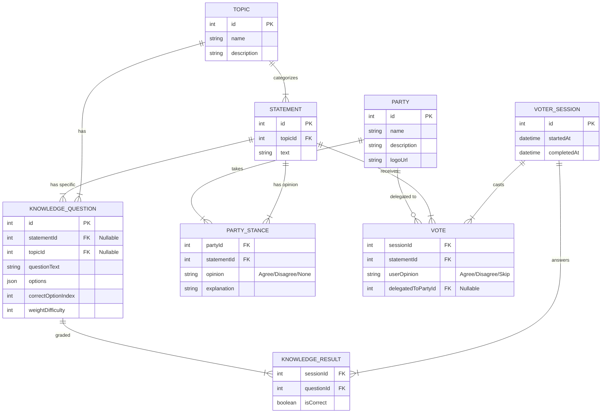

# Architecture Proposal: Digitale Directe Democratie

This document outlines the technical architecture for a new voting aid platform that integrates knowledge testing, topic-based analysis, and weighted voting.

## 1. System Overview
The goal is to build a modular web application that extends the traditional "Stemwijzer" concept. The key differentiator is the "Knowledge Layer" which qualifies votes based on the voter's understanding of the specific topic.

### Key Pillars
1.  **The Compass (Stemhulp)**: The core voting interface.
2.  **The Knowledge Engine**: Integrated testing mechanisms to gauge voter expertise.
3.  **The Proxy System**: Ability to delegate votes to political parties (blind trust).
4.  **The Analytics Hub**: Comparative analysis of "Popular Opinion" vs. "Informed Opinion".

## 2. Technology Stack

### Frontend
*   **Framework**: **Next.js 14+** (App Router). This provides server-side rendering for SEO, fast initial loads, and a robust routing system for the different modules.
*   **Language**: **TypeScript** for type safety and maintainability.
*   **Styling**: **Vanilla CSS / CSS Modules**. Focused on high-end, premium aesthetics (Glassmorphism, smooth animations) without the constraints of utility classes, ensuring a unique visual identity.
*   **State Management**: React Context / Hooks for local state; potential use of Zustand if global state becomes complex.

### Backend & Database
*   **API**: **Next.js Server Actions / API Routes**. This keeps the architecture simple (Monolithic) and deployment easy on Vercel.
*   **Database**: **PostgreSQL**. A relational database is essential for the structured data (Statements, Topics, Votes, Parties).
*   **ORM**: **Prisma**. For type-safe database access and easy migration management.

### External Services / Integration
*   **Data Scraping**: Custom Node.js scripts (using Cheerio or Puppeteer) to ingest data from existing repositories (e.g., open-source Stemwijzer scrapers) and map them to our schema.

## 3. Data Model (Conceptual ERD)

### Core Entities

## 4. Functional Modules

### Module A: The Scraper & CMS (Admin)
*   **Function**: Populates the database.
*   **Features**:
    *   Import tool to fetch current election statements.
    *   **Enrichment Interface**: A dashboard where the admin can:
        *   Assign a `Topic` to a `Statement`.
        *   Create `KnowledgeQuestions` for that specific statement/topic.

### Module B: The Voter Interface (Client)
*   **UX Flow**:
    1.  **Onboarding**: Brief explanation of the concept.
    2.  **The Loop** (Repeats for ~30 statements):
        *   **Step 1: Check**: Present 1-3 multiple choice `KnowledgeQuestions` related to the upcoming topic/statement.
        *   **Step 2: Statement**: Show the statement.
        *   **Step 3: Action**:
            *   *Option A*: Vote Agree/Disagree/Neutral.
            *   *Option B*: "I don't know, I trust [Party X]" (Proxy Vote).
    3.  **Results**: Present the match.

### Module C: Analytics & weighting (The "Insight" Engine)
*   **Function**: Calculates the results.
*   **Logic**:
    *   *Basic Score*: Standard matching (like Stemwijzer).
    *   *Topic Expertise Score*: Calculates the user's `% correct` per Topic.
    *   *Weighted Analysis*: "Users with >80% knowledge on this topic voted X, whereas the general population voted Y."

## 5. Implementation Roadmap
1.  **Setup**: Initialize Next.js, Prisma, Postgres.
2.  **Data Layer**: Define schema, create seed script (mock data).
3.  **Scraper Prototype**: Build a script to fetch data from a known source.
4.  **Admin UI**: Build the enriching interface to add Questions/Topics.
5.  **Voter UI**: Build the main interaction loop (high aesthetic focus).
6.  **Analytics**: Implement the weighted scoring logic.
