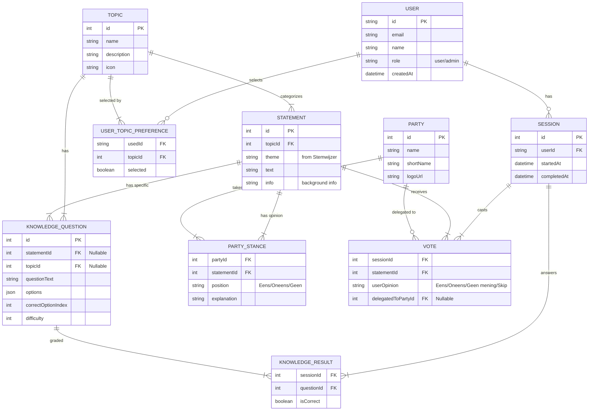

# Architecture Proposal: Democratie Digitaal

This document outlines the technical architecture for a voting aid platform that integrates knowledge testing, topic-based analysis, and weighted voting.

## 1. System Overview
The goal is to build a modular web application that extends the traditional "Stemwijzer" concept. The key differentiator is the **Knowledge Layer** which qualifies votes based on the voter's understanding of the specific topic.

### Key Pillars
1.  **The Compass (Stemhulp)**: The core voting interface.
2.  **The Knowledge Engine**: Integrated testing mechanisms to gauge voter expertise.
3.  **The Proxy System**: Ability to delegate votes to political parties (blind trust).
4.  **The Analytics Hub**: Comparative analysis of "Popular Opinion" vs. "Informed Opinion".
5.  **Authentication & Onboarding**: User login and topic selection before voting.
6.  **Admin CMS**: Content management for topics, statements, and knowledge questions.

## 2. Technology Stack

### Frontend
*   **Framework**: **Next.js 16** (App Router).
*   **Language**: **TypeScript** for type safety.
*   **Styling**: **Tailwind CSS** with custom design tokens.
*   **State Management**: React Context / Hooks; Zustand for complex global state.

### Backend & Database
*   **API**: **Next.js Server Actions / API Routes**.
*   **Database**: **PostgreSQL** (via Vercel Postgres or Supabase).
*   **ORM**: **Prisma** for type-safe database access.
*   **Authentication**: **NextAuth.js** for flexible auth providers.

### External Services / Integration
*   **Stemwijzer Data**: Import from [afvanwoudenberg/stemwijzer](https://github.com/afvanwoudenberg/stemwijzer) JSON format containing 30 statements with party positions.

## 3. Data Model (Conceptual ERD)

## 4. Functional Modules

### Module A: Authentication & Onboarding
*   **Default Accounts**:
    *   **User**: email: `burger`, password: `Burger` (Role: USER)
    *   **Admin**: email: `admin`, password: `Admin` (Role: ADMIN)
*   **Login**: NextAuth Credentials provider for internal accounts.
*   **Onboarding Flow**:
    1.  Welcome screen with app explanation.
    2.  "Start met het geven van je mening" button.
    3.  **Topic Selector**: Multi-select with all topics pre-checked.
    4.  Proceed to voting.

### Module B: The Voter Interface (Client)
*   **UX Flow**:
    1.  **Topic Selection**: Choose which topics to vote on (filtered experience).
    2.  **The Loop** (per selected topic's statements):
        *   **Step 1**: Knowledge question(s) about the topic.
        *   **Step 2**: Show the statement.
        *   **Step 3**: Vote (Eens/Oneens/Geen mening) or Proxy.
    3.  **Results**: Match with parties.

### Module C: Admin CMS
*   **Features**:
    *   **Topics Management**: CRUD for topics.
    *   **Statements Management**: 
        *   Import from Stemwijzer JSON.
        *   Manual CRUD per topic.
    *   **Knowledge Questions**:
        *   Create/edit questions per topic or statement.
        *   Set correct answer and difficulty.
    *   **Parties**: Manage party list and logos.
    *   **Statistics**: Dashboard with user activity, topic popularity, and knowledge levels.
*   **Access**: Protected route, admin role only.

### Module D: Stemwijzer Integration
*   **Import Script**: Parse `tweedekamer2025.json` and populate:
    *   Statements (theme, title, info).
    *   Parties (extract unique party names).
    *   Party Stances (position + explanation per party per statement).
*   **Admin Enrichment**: Add topics and knowledge questions to imported data.

### Module E: Analytics & Weighting
*   **Basic Score**: Standard Stemwijzer-style matching.
*   **Knowledge Score**: Per-topic expertise percentage.
*   **Weighted Analysis**: Compare "informed opinion" vs "general opinion".

## 5. Implementation Roadmap

### Phase 1: Foundation ✅
- [x] Initialize Next.js project
- [x] Setup design system (Tailwind + CSS tokens)
- [x] Build core UI components (Header, StatementCard, KnowledgeCard)
- [x] Implement basic voting flow with mock data

### Phase 2: Authentication & Data Layer
- [ ] Setup Prisma + PostgreSQL
- [ ] Implement NextAuth.js authentication
- [ ] Create database schema (migrations)
- [ ] Build Stemwijzer JSON import script

### Phase 3: Onboarding Flow
- [ ] Login/Register pages
- [ ] Welcome/onboarding screen
- [ ] Topic selector component
- [ ] Session management

### Phase 4: Admin CMS
- [ ] Admin layout & navigation
- [ ] Topics CRUD interface
- [ ] Statements management (import + manual)
- [ ] Knowledge questions editor
- [ ] Parties management

### Phase 5: Analytics & Polish
- [ ] Results calculation engine
- [ ] Results display page
- [ ] Weighted analysis views
- [ ] Performance optimization
